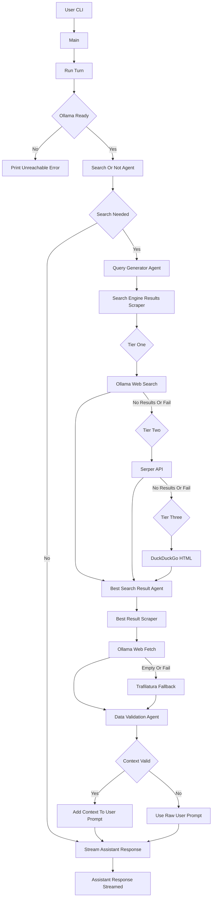

# Agent Search

A local Python assistant powered by Ollama with optional web augmentation.

The runtime pipeline now executes from `src/` modules (with `ollama_web_search.py` as compatibility launcher):

- Decide whether search is needed
- Generate a query
- Fetch results through a 3-tier fallback chain
- Select best URL
- Fetch and validate context
- Answer with streamed output

## Refactor Status

- Refactor-first migration is in progress (see `neststep.md`).
- Phase 0 baseline is documented in `docs/refactor_baseline.md`.
- Phase 2/3 extraction is active: core search/fetch/validation/orchestration flow now runs through `src/`.

## Features

- Local LLM chat via Ollama
- One-shot and interactive chat modes
- Search fallback chain:
  1. Ollama `web_search`
  2. Serper API (if `SERPER_API_KEY` is set)
  3. DuckDuckGo HTML scraping fallback
- Content fetch fallback:
  1. Ollama `web_fetch`
  2. Trafilatura extraction
- Context validation before prompt injection
- Debug logs for pipeline observability
- Ollama readiness check before each turn

## Project Structure

```text
.
├── ollama_web_search.py     # Compatibility launcher
├── src/
│   ├── app/                 # CLI + config + orchestrator + models/interfaces
│   ├── services/            # Decision/query/search/rank/fetch/validate/respond logic
│   └── infra/               # Ollama client + HTTP helpers + logging scaffold
├── tests/                   # Unit + integration scaffold
├── docs/refactor_baseline.md
├── requirements.txt         # Python dependencies
├── .env.example             # Environment variable template
├── pyrightconfig.json       # Type-checker config
└── .ai/                     # Persistent project memory/handoff docs
```

## Requirements

- Python 3.10+
- Ollama installed and running
- Ollama Python SDK `>=0.6.0`
- Internet access for search-enabled turns
- Optional: Serper API key for better search quality

## Setup

```bash
python -m venv venv
source venv/bin/activate
pip install -r requirements.txt
cp .env.example .env
```

Start Ollama:

```bash
ollama serve
```

Pull your preferred model (example):

```bash
ollama pull granite4:latest
```

## Environment Variables

Set these in `.env`:

- `OLLAMA_MODEL` (default in code: `qwen2.5:0.5b`)
- `OLLAMA_HOST` (example: `http://localhost:11434`)
- `OLLAMA_API_KEY` (optional, for secured remote Ollama hosts)
- `SERPER_API_KEY` (optional)
- `AGENT_DEBUG` (`1` or `0`)

## Usage

Interactive chat:

```bash
python ollama_web_search.py
```

One-shot query:

```bash
python ollama_web_search.py "latest bitcoin price in USD"
```

With options:

```bash
python ollama_web_search.py --model granite4:latest --max-results 5 --debug "your query"
```

Module CLI entrypoint:

```bash
python -m src.app.cli "your query"
```

## Pipeline Overview

1. `DefaultTurnOrchestrator.run_turn()` coordinates each turn.
2. `DecisionEngineService.should_search()` decides if fresh data is needed.
3. `QueryGeneratorService.generate()` creates concise web query text.
4. `FallbackSearchProvider.search()` tries:
   1. Ollama `web_search`
   2. `_serper_search()`
   3. `_duckduckgo_search()`
5. `RankingService.pick_best()` selects best URL.
6. `FetcherService.fetch()` fetches content (`web_fetch` then Trafilatura).
7. `ValidatorService.is_relevant()` validates context relevance.
8. Context is appended only when validated.
9. `ResponderService.stream()` streams final output.

## System Design UML



## Troubleshooting

- `Ollama is not running or unreachable`
  - Run `ollama serve`.
  - Check `OLLAMA_HOST`.

- `Failed to connect` with `localhost`
  - Use `OLLAMA_HOST=http://127.0.0.1:11434` if your environment resolves `localhost` incorrectly.

- Search quality is weak
  - Set `SERPER_API_KEY` in `.env`.
  - Keep `AGENT_DEBUG=1` to inspect each stage.
